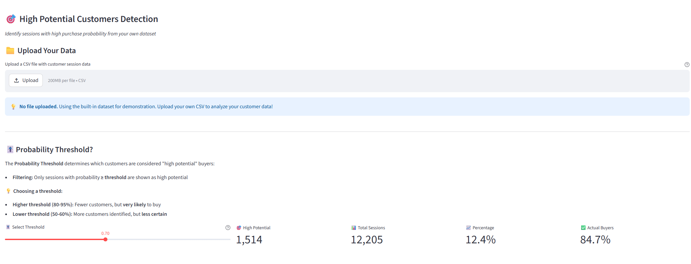
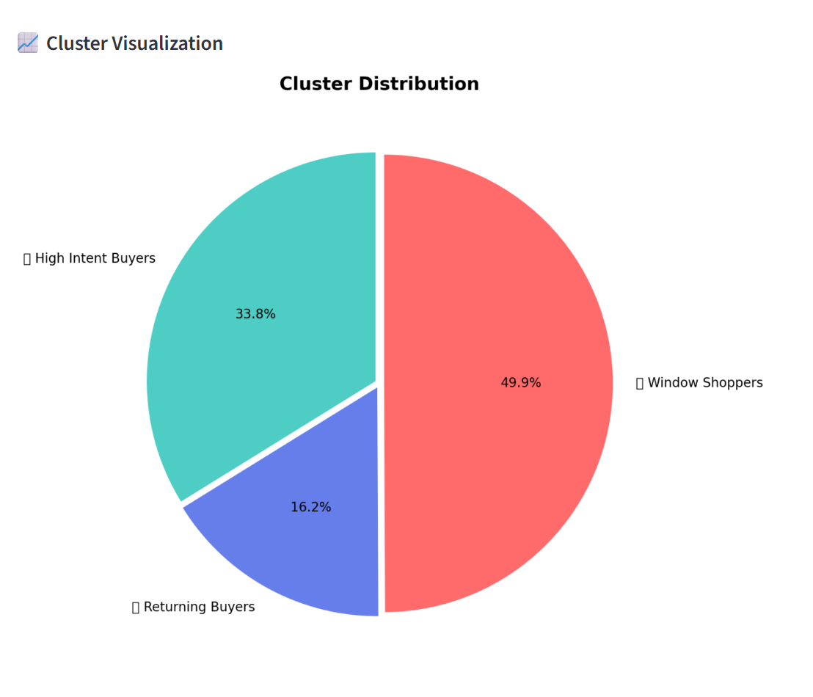
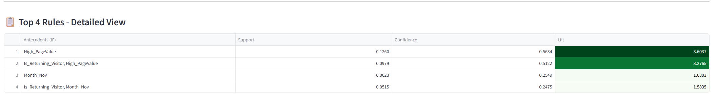
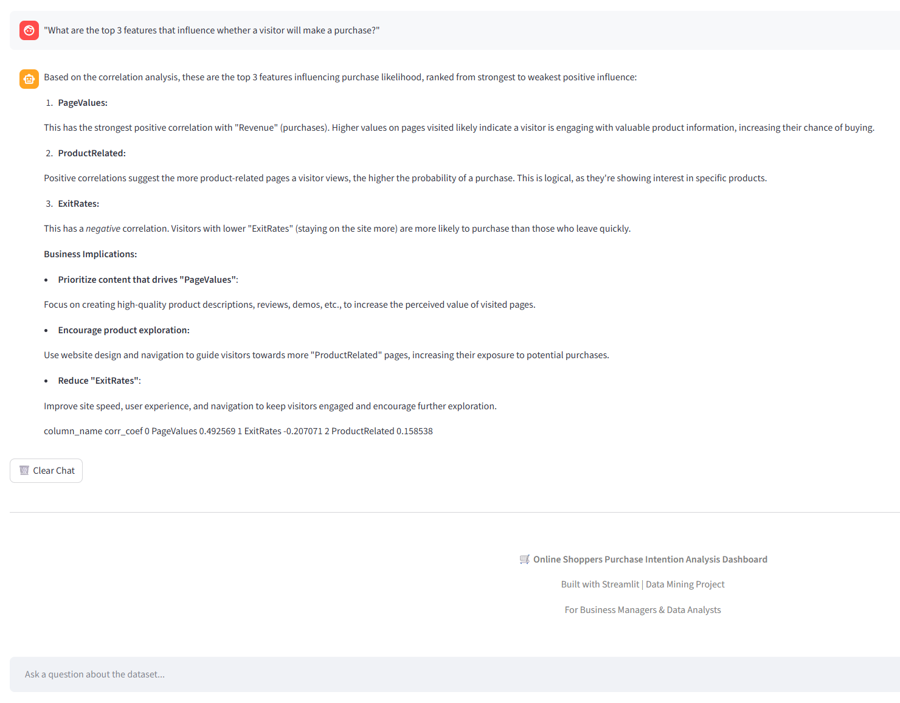
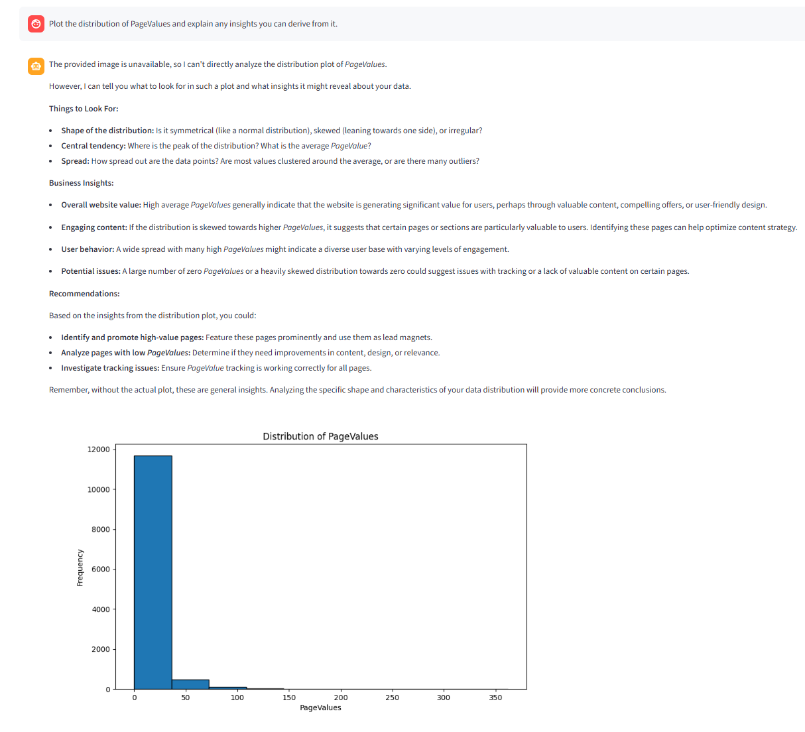

# Online Shoppers Purchase Intention Dashboard

This dashboard is designed to help non-technical users turn customer data into clear business insights without needing to write code.

Target users:
- Business managers
- Marketing teams
- Sales and operations teams
- Anyone who works with CSV files but does not have a data science background

What the app does:
- Upload customer session data in CSV format
- View simple dashboard summaries and visual reports
- Identify customers who are most likely to buy
- Understand the key factors that influence purchase intent
- Ask an AI assistant questions in plain language

## Main Application

The main app file is app.py.

## Features and Functions in app.py

### 1) Data Loading and Preparation

- load_data()
	- Reads online_shoppers_intention.csv
	- Removes duplicate rows
- prepare_encoded_data(df)
	- Encodes Month into ordered numeric values
	- Encodes VisitorType
	- Converts Weekend and Revenue to integer

### 2) Classification Model

- train_xgboost(df_encoded)
	- Splits data into train and test sets
	- Scales features with StandardScaler
	- Handles class imbalance using SMOTE
	- Trains XGBClassifier
	- Returns model, evaluation metrics, confusion matrix, and feature importance

What this means for non-technical users:
- Classification is a simple upload-and-result function.
- You upload a CSV file and the app estimates each session's purchase probability.
- The dashboard highlights which customer sessions are highly intended to buy, shown as percentages.
- You can set a threshold and export the high-potential customer list directly.

### 3) Clustering Analysis

- perform_clustering(df)
	- Uses KMeans with ProductRelated_Duration and BounceRates
	- Computes elbow values (WCSS)
	- Creates 2 clusters and evaluates with Adjusted Rand Index

Clustering page also supports upload of high-potential customer CSV and groups sessions into:
- High Intent Buyers
- Returning Buyers
- Window Shoppers

What this means for non-technical users:
- Clustering shows customer groups visually.
- It helps identify which group has the highest likelihood to buy.
- This supports targeted campaigns and better segmentation decisions.

### 4) Association Rule Mining

- perform_association_rules(df)
- perform_association_rules_custom(data)
	- Builds binary transaction-like features
	- Generates frequent itemsets with Apriori
	- Generates association rules
	- Filters rules where consequent is Is_Revenue

Association Rules page shows:
- Top rules leading to purchases
- Support, confidence, and lift comparisons
- Feature ranking style interpretation

What this means for non-technical users:
- Association Rules show which columns are most important for purchase intent.
- It explains what combinations of behavior are strongly linked to buying.
- This helps teams focus on the most impactful business factors.

### 5) AI Business Analyst

The AI Analyst page allows natural-language questions about the dataset.
Flow:
- User asks question in chat
- PandasAI generates a data-grounded response
- LLM produces concise business interpretation

What this means for non-technical users:
- The AI Business Analyst is a chatbot for data questions.
- It uses a RAG-style approach with PandasAI to retrieve and analyze dataset information.
- Users can ask for insights, summaries, and extracted information without SQL or coding.

## Function Section (Add Your Function Screenshots Here)

Create a folder named screenshots in your project root, then save image files and reference them like below.

### Home / Overview
### Classification Dashboard


Upload the CSV file in this section to generate purchase-intent predictions.
### High Potential Customers
)
This section shows the purchase probability for each customer and helps users quickly identify the highest-intent sessions.

### Clustering Result

By uploading the CSV file, you can view a chart that shows how your customers are distributed across different groups.

### Association Rules

This section shows which factors have the strongest impact on whether customers decide to buy.

### AI Analyst Chat

Use the AI assistant to get insights from your data.

You can also ask the AI to explain trends or generate plots.

## How to Run

1. Activate your virtual environment.
2. Install dependencies:

```bash
pip install streamlit pandas numpy matplotlib seaborn scikit-learn xgboost imbalanced-learn mlxtend pandasai litellm pandasai-litellm
```

3. Run the app:

```bash
streamlit run app.py
```

## Notes

- Do not name your script streamlit.py because it conflicts with the Streamlit package import.
- If you see imbalanced-learn and scikit-learn compatibility errors, upgrade both packages together.